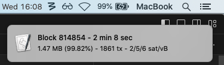
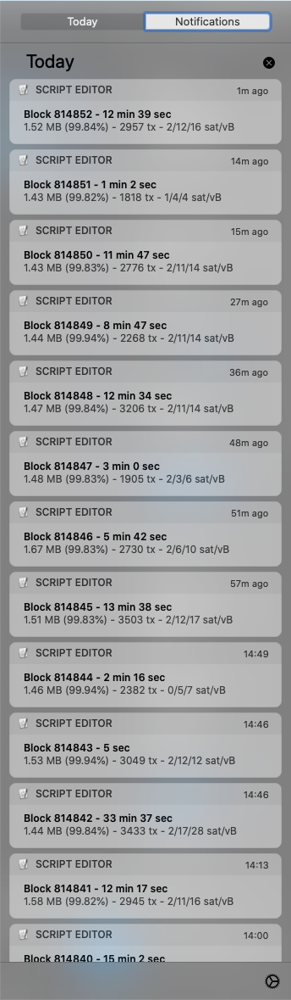
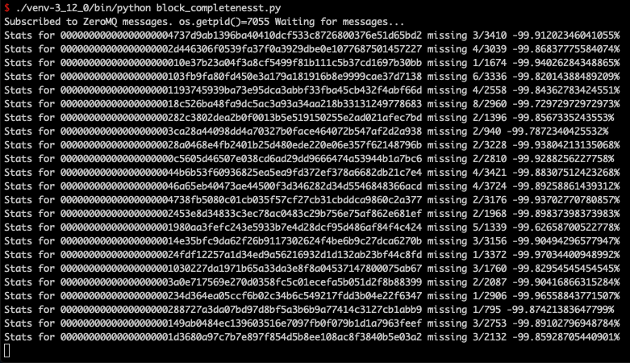

# lip-bitcoin_core_rpc

## Requirements
Developed with Python:
 - [version](https://github.com/sasa-buklijas/lip-bitcoin_core_rpc/blob/main/.python-version)
 - [packages](https://github.com/sasa-buklijas/lip-bitcoin_core_rpc/blob/main/requirements.txt)

## Code Examples
### [new_block_notification.py](./new_block_notification.py)  
Uses bitcon-core ZeroMQ(zmqpubhashblock) to monitor for new blocks.  
On OSX(macOS) notification is displayed on screen with block statistic.  
OSX screenshots:  
OSX Notification Pop-up  
  
OSX Notification Center  

### block_completeness.py 
[block_completeness.py](./block_completeness.py)  
Inspired by: ["A node knows 99.953% of all the transactions in a block, before the block arrives."](https://btctranscripts.com/greg-maxwell/2017-11-27-gmaxwell-advances-in-block-propagation/#original-bitcoin-block-relay-protocol).  
It is tool for calculating how many bitcoin transaction are missing from local bitcoin node mempool when new bitcoin block is mined. Uses [ZeroMQ](https://github.com/bitcoin/bitcoin/blob/master/doc/zmq.md) `pubhashblock` and `pubsequence`.   
Screenshot:

### [getbestblockhash.py](./getbestblockhash.py)  
Hello world example for bitcon-core RPC.

### [mempool_change.py](./mempool_change.py)  
Polling bitcoin-core mempool via RPC(getmempoolinfo) to calculate difference between added and removed txids.  
If pooling is to slow, use [bitcoin-core ZeroMQ streams](https://bitcoindev.network/accessing-bitcoins-zeromq-interface/). 

